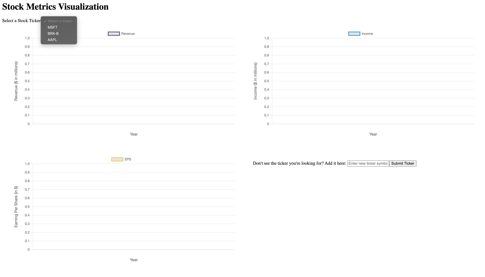
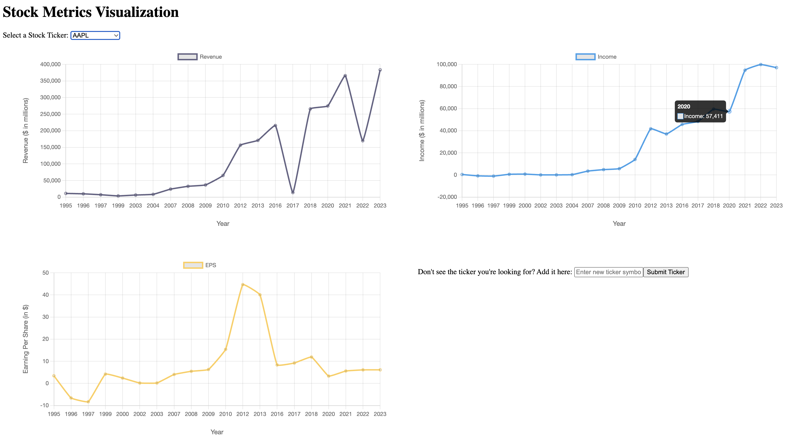
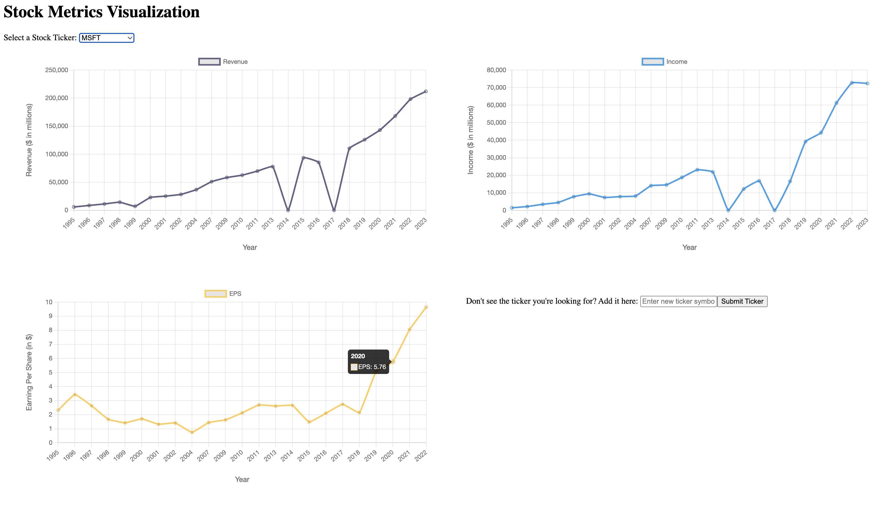
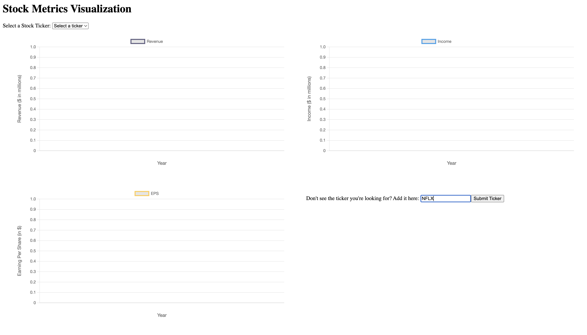
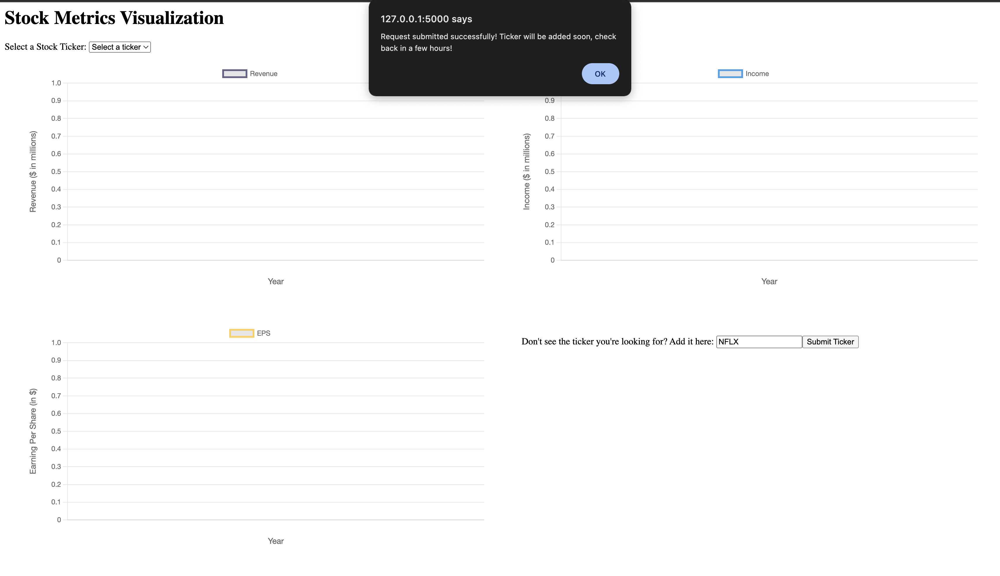
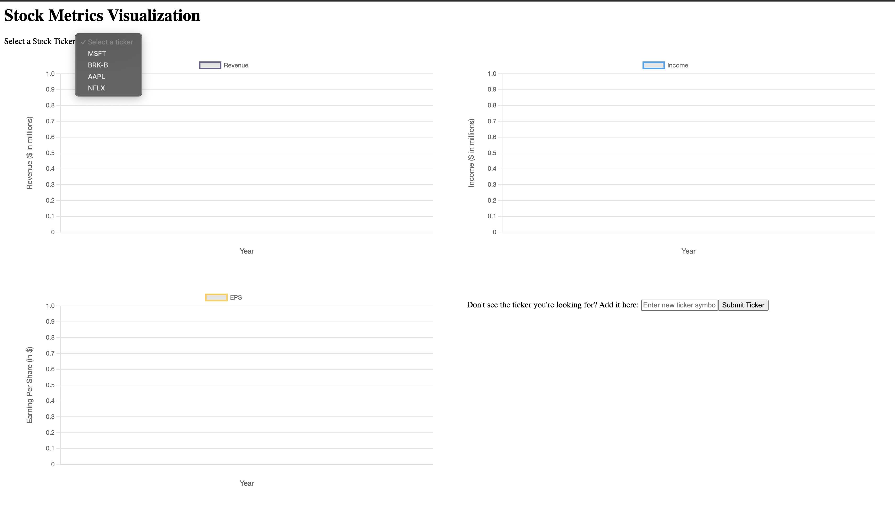

# Stock-Ticker-10K-Analyzer
This is a project to analyze the 10-K filings of companies using LLMs and create visualizations

## Technology Stack

**Vector Database: ChromaDB**

ChromaDB was selected as the vector database since it is a popular open-source vector database. It provides the ability to create Collections and also the ability to store documents along with their embeddings. These two features were the main reason for using ChromaDB.

**LLM Provider: Azure OpenAI**

Azure OpenAI was used as the LLM provider since free Azure credits are available to students. These free credits can be used to deploy and use an LLM of choice on Azure.

**LLM: GPT-35-turbo-16k**

Taking into account the costs as well as the context length, the GPT 3.5 model with a 16k token limit was chosen as the model for this project.

**Backend: Flask in Python**

The data was downloaded using the `sec_edgar_downloader` library and the chromaDB and OpenAI SDKs were used for data processing and analysis, all done in python. Hence it was easy to create a simple python web application using Flask.

## Code Structure

Front end:
- [`index.html`](./Code/templates/index.html)

Back end: 
- [`app.py`](./Code/app.py)
- [`ingest.py`](./Code/ingest.py)
- [`analytics.py`](./Code/analytics.py)

## Workflow

[`index.html`](./Code/templates/index.html) and  [`app.py`](./Code/app.py)
1. A new ticker symbol is entered into the textbox on the dashboard, and submitted.

 

 

[`ingest.py`](./Code/ingest.py)

2. The 10K filings for the company from 1995-2023 (whichever are available given the company's IPO date) are downloaded.
3. The filings are pre-processed.
4. Each of the filings are chunked, converted into embeddings, and stored in ChromaDB.

[`analytics.py`](./Code/analytics.py)

5. For each year, the required metrics (Eg: revenue, income, earnings per share) are analysed through _Retrieval Augmented Generation_.
6. The metrics are stored as a JSON file.

The ticker can then be selected from the drop-down on the dashboard, and the metrics can be visualized.

The metrics for the new ticker can be visualized only after the data has been downloaded and processed. 

_(Tested on Mac M2: It takes about 2 hours for a new ticker's metrics to be generated)_